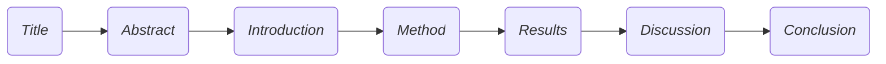
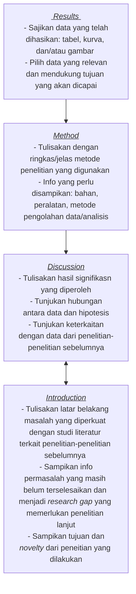

# nim
1. Ganti nim dia atas dengan NIM Anda, seperti 99921001.
2. Hanya berkas ini yang akan diperiksa, sehingga bila ada jawaban yang tercantum pada berkas lain, tautan dari berkas ini ke berkas lain tersebut harus dibuat dan tercantum pada berkas ini.
3. Kerjakan yang diberikan berikut ini.


## soal 0
Pelajari
+ [Dasar-dasar cara menulis dan memformat berkas Markdown di Github](https://docs.github.com/en/get-started/writing-on-github/getting-started-with-writing-and-formatting-on-github/basic-writing-and-formatting-syntax)<br>(akan diterapkan pada tautan **Jawaban** di bawah setiap soal dan isi berkas yang dirujukanya),
+ [Dasar-dasar sintaks Mermaid untuk membuat diagram alir di GitHub](https://mermaid-js.github.io/mermaid/#/flowchart)<br>
(akan digunakan pada saat membuat digram alir proses pengerjaan artikel ilmiah),
+ [Cara menulis persamaan matematika dengan Markdown di GitHub](https://docs.github.com/en/get-started/writing-on-github/working-with-advanced-formatting/writing-mathematical-expressions)<br>
(akan dimanfaatkan saat menampilkan persamaan matematika yang digunakan).


## soal 1
Bagaimana Anda dapat menentukan suatu jurnal termasuk dalam kategori Q4, Q3, Q2, atau Q1? Jelaskan dan cantumkan tautan ke sumber yang diperlukan.

+ [Jawaban 1]()

Kualitas suatu jurnal diketegorikan menjadi beberapa kuartil yaitu Q4, Q3, Q2, atau Q1 yang memperlihatkan bagaimana **rangking dari jurnal pada area disiplin ilmu tertentu**.
<br> 
Untuk menentukan kuartil dari suatu jurnal digunakan standar nilai **Impact Factor (IF)** dan nilai **Scimago Journal Rank (SJR)**. Impact Factor suatu jurnal dihitung berdasarkan jumlah sitasi dari manuskrip yang terbit pada dua tahun terakhir dibagi dengan jumlah artikel yang diterbitkana dalam kurun waktu tersebut (dua tahun teakhir). Sedangkan nilai SJR dihitung berdasarkan bobot, jumlah sitasi dengan memperhitungkan kualitas/reputasi dari jurnal pada artikel-artikel yang diterbitkan selama tiga tahun terakhir.<br>

Q1 berisikan jurnal-jurnal yang menempati top 25% rangking tertingggi dalam bidang tertentu. Q2 merupakan kelompok jurnal pada peringkat 25-50% teratas, Q3 ditempati oleh jurnal peringkat 50-75%, dan terakhir Q4 yang diisi oleh jurnal dalm kelompok 75-100%.

<br> Adapun metode untuk mengetahui kategori kuartil dari suatu jurnal dapat di cek pada halaman laman [Scimago Journal Rank](https://www.scimagojr.com/) atau [Scopus](https://www.scopus.com/).
-	Pada laman [Scimago Journal Rank](https://www.scimagojr.com/) kita tinggal menuliskan nama jurnal yang dituju untuk kemudain dienter. Selanjutnya akan tertampil informasi terkait indeksasi dan quartil (langsung dalam info Q1, Q2, Q3, atau Q4) dari jurnal tersebut.
-	Pada laman [Scopus](https://www.scopus.com/), klik bagian Sources dan pilih Title (isi nama jurnal yang akan dipilih) kemudain dienter. Selanjutnya akan tertampil nilai dari percentil dari jurnal tersebut. Sebagi informasi karena Q1 merupakan jurnal yang menempati rangking 25% tertinggi pada satu disiplin ilmu tertentu, maka pada laman Scopus Q1 akan ditempati oleh jurnal-jurnal dengan nilai “Highest percentile” diatas 75% begitu juga untuk Q2-Q3 akan menyesuaikan sesuai dnegan urutan rangking jurnal


<br>Tautan:<br>
a.	https://www.mondragon.edu/en/web/biblioteka/publications-impact-indexes<br>
b.	https://www.scimagojr.com/<br>
c.	https://www.scopus.com/


## soal 2
Tuliskan empat jurnal bidang Anda, yang mungkin kelak akan menjadi target Anda mengirimkan artikel ilmiah, dengan masing-masing termasuk dalam kategori Q4, Q3, Q2, dan Q1. Cantumkan pula tautan ke jurnal-jurnal tersebut dan situs web lain yang menyatakan bahwa jurnal-jurnal tersebut termasuk dalam kategori yang dimaksud.

+ [Jawaban 2]()
+ List target jurnal untuk masing-masing quartil <br>
**a. ACS Applied Energy Materials** [link](https://pubs.acs.org/journal/aaemcq)<br>
Masuk dalam **kategori Q1**, dengan nilai SJR 2021 (1.61) [1,2]<br>
**b. Journal of Solid State Electrochemistry** [link](https://www.springer.com/journal/10008)<br> 
Masuk dalam **kategori Q2**, dengan nilai SJR 2021 (0.53) [3,4]<br>
**c. The Electrochemical Society Interface** [link](https://iopscience.iop.org/journal/1944-8783)<br>
Masuk dalam **kategori Q3**, dengan nilai SJR 2021 (0.564) [5,6]<br>
**d. Journal of Electrochemical Science and Technology** [link](https://www.jecst.org/) <br>
Masuk dalam **kategori Q4**, dengan nilai SJR 2021 (0.459) [7,8]<br>

+ Tautan:<br>
[1] ACS Applied Energy Materials identification in [Scimagojr.com](https://www.scimagojr.com/journalsearch.php?q=21100904205&tip=sid&clean=0) <br>
[2] ACS Applied Energy Materials identification in [Scopus.com](https://www.scopus.com/sourceid/21100904205) <br>
[3] Journal of Solid State Electrochemistry identification in [Scimagojr.com](https://www.scimagojr.com/journalsearch.php?q=25199&tip=sid&clean=0) <br>
[4] Journal of Solid State Electrochemistry identification in [Scopus.com](https://www.scopus.com/sourceid/25199) <br>
[5] The Electrochemical Society Interface identification in [Scimagojr.com](https://www.scimagojr.com/journalsearch.php?q=25168&tip=sid&clean=0) <br>
[6] The Electrochemical Society Interface identification in [Scopus.com](https://www.scopus.com/sourceid/25168) <br>
[7] Journal of Electrochemical Science and Technology in [Scimagojr.com](https://www.scimagojr.com/journalsearch.php?q=21100399753&tip=sid&clean=0) <br>
[8] Journal of Electrochemical Science and Technology in [Scopus.com](https://www.scopus.com/sourceid/21100399753)


## soal 3
Jelaskan apa yang dimasksud dengan struktur organisasi suatu artikel ilmiah IMRaD? Cantumkan rujukan yang Anda gunakan untuk menjelaskan.

+ [Jawaban 3]()

Secara bahasa IMRaD merupakan kepanjangan dari *Introduction, Method, Results, and Discussion*.<br>
IMRaD memberikan acuan bagaimana menyusun suatu artikel ilmiah ilmiah yang baik dan terstruktur serta mudah dipahami oleh pembaca.<br>
Struktur ini membantu penulis agar fokus pada pokok bahasan dan tidak melebar selama proses penulisan artikel dan antar bagian dalam artikelnya saling berkesinambungan.<br>

Adapun struktur organisasi artikel ilmiah yang menganut IMRaD memiliki empat bagian utama, yaitu:<br>
-	*Introduction*: berisi uraian tentang latar belakang yang menggambarkan bagaimana posisi penelitian-penelitian sebelumnya (tinjauan pusataka), rumusan masalah terkait *research gap* yang belum terjawab, dan tujuan dari penelitian yang dilakukan yang didalamnya memperlihatkan keterbaharuan.<br>
-	*Method*: bagian ini membahas bagaimana cara/metode yang digunakan untuk menjawab permasalahan yang disebutkan dalam pendahuluan.<br>
-	*Results*: mengemukaan hal-hal apa saja yang diperoleh yang dapat disajikan dalan bentuk tabel, grafik/kurva, dan gambar.<br>
-	*Discussion*: berisikan penjelasan komperhensif terkait hasil signifikan yang diperoleh, apa implikasi/hubungannya dengan permasalahan yang diangkat, dan keterkaitan denegan penelitian sebelumnya sebagai dasar untuk membuat suatu kesimpulan.<br>


Tautan:<br>
[Scientific Editing, What Is IMRaD? IMRaD Format in Simple Terms!](https://www.scientific-editing.info/blog/what-is-imrad/)<br>
[Sollaci LB, Pereira MG. The introduction, methods, results, and discussion (IMRAD) structure: a fifty-year survey. J Med Libr Assoc. 2004 Jul;92(3):364-7.](https://www.ncbi.nlm.nih.gov/pmc/articles/PMC442179/)


## soal 4
Terkait dengan struktur artikel limiah menurut IMRaD, buat diagram alir dengan Mermaid untuk menggambarkan urut-rutan bagian yang dikerjakan dan iterasi yang diperlukan. Cantumkan rujukan yang digunakan.

+ [Jawaban]()

Suatu artikel yang menganut IMRaD maka akan memiliki struktur umum (awal-->akhir) sebagai berikut:



Meskipun urutannya sperti yang terlihat pada gambar diatas, dalam proses penyusunannya bukan secara urut dari kanan ke kiri, akan tetapi alur yang digunakan selama proses penyusunan artikel ilmiah berdasarkan IMRaD (khususnya untuk bagian *Introduction*, *Method*, *Results*, dan *Discussion*) adalah sebagi berikut:


Dari gambar diatas terlihat bawa pada saat proses penyusunan discussion akan juga terkait erat dengan introduction. Sehingga selama proses penulisan, merupakan hal yang wajar setelah menulis into kembali memperbaiki bagian diskusi.<br>
Selanjutnya setelah ke emapt bagian IMRaD tersususn kita bisa membuat kesimpulan, dan paling akhir adalah membuat abstrak.<br>

Tautan:<br>
[Wu, J. Improving the writing of research papers: IMRAD and beyond. Landscape Ecol 26, 1345–1349 (2011)](https://link.springer.com/article/10.1007/s10980-011-9674-3#citeas)<br>
[Montagnes, D.J.S., Montagnes, E.I. & Yang, Z. Finding your scientific story by writing backwards. Mar Life Sci Technol 4, 1–9 (2022)](https://link.springer.com/article/10.1007/s42995-021-00120-z#citeas)


## soal 5
Cantumkan sebuah persamaan utama yang akan digunakan dalam penelitian Anda, dapat dalam bagian teori, pengambilan data, pengolahan data, ataupun analisis.

+ [Jawaban 5]()

**Persamaan Koutecký−Levich (K−L plot)** <br>Digunakan untuk menghitung nilai elektron transfer number pada reaksi reduksi oksigen (ORR)

$$\frac{1}{j}=\frac{1}{j_L}+\frac{1}{j_K}=\frac{1}{0.62nFAC_{O_2}(D_{O_2})^{2/3}ν^{-1/6}ꞷ^{1/2}}+\frac{1}{nFkj_0}$$

$$gradien=(0.62nFAC_{O_2}(D_{O_2})^{2/3}ν^{-1/6})^{-1}$$

dengan F adalah konstanta Faraday (96485 C/mol), A adalah luasan geometerik elektroda kerja, J<sub>K</sub> adalah kinetic-limiting current density, ω adalah kecepatan sudut (rad/s), C<sub>O2</sub> dan D<sub>O2</sub> masing-masing adalah konsentrasi bulk dan konstanta difusi dari O<sub>2</sub> pada elektrolit yang digunakan, dan υ adalah viskositas kinematik.


## soal 6
Apakah yang dimaksud dengan jurnal pemangsa? Apakah yang dimaksud dengan penerbit pemangsa? Apakah perbedaannya dengan jurnal pemangsa? Jelaskan dengan memberikan rujukan yang digunakan.

+ [Jawaban 6]()

**Jurnal pemangsa** atau *predatory journal* adalah jurnal yang tidak mengikuti tahapan standar penerbitan seperti proses peer-review dan hanya bertujuan untuk mendapatkan keuntungan (profit).<br>
**Penerbit pemangsa** adalah penerbit yang menerbitkan (menaungi) jurnal-jurnal pemangsa.<br>

**Perbedaan** dengan jurnal standar yang memerlukan waktu yang cukup lama untuk proses review hingga penerbitannya, jurnal pemangsa menawarkan waktu yang relative jauh lebih singkat.<br>
Adapun beberapa kriteria umum dari jurnal pemangsa antara lain:<br>
a.	Tidak meyediakan proses peer-review yang mencukupi.<br>
b.	Mengcantumkan nilai Journal Impact Faktor (IF) pada laman website yang salah atau tidak terverifikasi.<br>
c.	Mencantumkan timeline waktu publikasi yang sangat cepat (tidak realistik).<br>
d.	Penulis diminta membayar APC padahal kualitas manuskrip yang diterbitjan rendah.<br>
e.	Artikel yang diterbitkan memiliki banyak kesalahan gramatikal, mengindikasikan keterbatasan/tidak adanya proses penyuntingan.<br>
f.	Mencantumkan nama-nama dewan penyunting atau editorial board yang tidak ada atau tidak kredibel dan tidak bisa diverifikasi.<br>
g.	Meniru/menyerupai nama-nama jurnal yang terlegimitasi.<br>
h.	Sangat masif dalam menawarkan journal kepada kandidat penulis melalu email.<br>
i.	Alamat kantor dan kontak berbeda negara.<br>
j.	Kurang transparan mengenai proses diterimanya artikel atau APC.<br>
k.	Penulis diminta menandatangai pengalihan hak cipta di awal, sebelum proses peer-review, sehingga menyulitkan jika akan dialihkan ke penerbit lain.<br>
l.	Menerbitkan artikel sebelum persetujuan penerbitan ditandatangani dan menolak menariknya bila penulis membatalkan pengiriman artikelnya.<br>
m.	Menghapus artikel atau keseluruhan jurnal dari web tanpa peringatan atau informasi pada para penulis.<br>

Tautan:<br>[Elmore SA, Weston EH. Predatory Journals: What They Are and How to Avoid Them. Toxicol Pathol. 2020 Jun;48(4):607-610.](https://www.ncbi.nlm.nih.gov/pmc/articles/PMC7237319/) <br>
[Beall's List of Potential Predatory Journals and Publishers](https://beallslist.net/)


## soal 7
Apa yang dimaksud dengan jurnal akses terbuka? Jelaskan dengan memberikan rujukan yang digunakan.


+ [Jawaban 7]()

a.	Jurnal akses terbuka atau *open access journal* adalah jurnal yang telah diterbitkan (telah selesai proses pree-review dan penyuntingan) yang dapat diakses dan diunduh dengan bebas oleh setiap orang [1]. <br>
b.	Jurnal akses terbuka adalah jurnal dengan teks penuh (*full texts*) yang tersedia dan dapat diakses gratis di laman website/internet. Dengan demikian pembaca dapat secara bebas membaca, mengunduh dan mencetaknya [2].<br>
c.	Jurnal akses terbuka adalah jurnal yang secara digital tersedia secara daring dan bebas diakses, tidak dikenai biaya dan sering hanya mempersyaratkan hak cipta dan lisensi yang tak terlalu membatasi, bila dibandingkan dengan karya yang diterbitkan secara tradisional, baik bagi pengguna (pembaca) maupun penulis [3].<br>
d.	Jurnal akses terbuka menawarkan akses bebas pada informasi dan penggunaan tak-terbatas sumber daya elektronik bagi setiap orang, di mana semua jenis konten digital dapat dibuat berakses terbuka, mulai dari teks sampai piranti lunak, suara, video, dan multi-media [4].<br>

Tautan:<br>
[1] [Elsevier, Open access journals](https://www.elsevier.com/open-access/open-access-journals)<br>
[2] [Lukman, Ekawati Marlina, Ratih Keumalasari, AlHafiz Akbar, Slamet Ryanto, Perkembangan open access jurnal ilmiah Indonesia, 2012](https://www.researchgate.net/publication/263008807_Perkembangan_Open_Access_Jurnal_Ilmiah_Indonesia)<br>
[3] [Cornell University Library, Open Access Publishing: What is Open Access?](https://guides.library.cornell.edu/openaccess)<br>
[4] [UNESCO Open Access Publication, What is open access?](https://en.unesco.org/open-access/what-open-access)


## soal 8
Apakah ada kaitan antara jurnal pemangsa dengan jurnal akses terbuka? Jelaskan dengan memberikan rujukan yang digunakan.

+ [Jawaban 8]()

Jurnal akses terbuka dan jurnal pemangsa pada hakikatnya merupakan dua jenis jurnal yang berbeda. Pada jurnal akses terbuka meskipun merka memberikan adanya biaya publikasi (APC) pada penulis, proses peer-review dan penyuntingan dilakukan secara jelas dan transparan. Dengan demikian, kualitas dari artikel yang diterbitakan dapat dipertanggung jawabkan. Hal ini berbeda dengan jurnal pemangsa, mereka menerapkan adanya biaya APC tetapi kualitas jurnal yang dihasikan rendah. Jadi jurnal pemangsa hanya memanfaatkan sistem jurnal akses terbuka sebagai “jebakan” menipu para kandidat penulis. 

Tautan:<br>
[Pearson GS. Open Access and Predatory Journals: Two Very Different Entities. Journal of the American Psychiatric Nurses Association. 2016;22(6):447-448.](https://journals.sagepub.com/doi/10.1177/1078390316668478)


## soal 9
Apa yang dimaksud dengan pengindeks jurnal? Sebutkan beberapa di antaranya yang Anda kenal. Cantumkan rujukan yang digunakan.

+ [Jawaban 9]()

Pengindeks jurnal dapat berupa suatu organisasi publik, perusahaan analitik, atau penerbit yang memiliki kewenangan, dipercaya, dan kredibel untuk membuat suatu daftar basis data jurnal (bibliografi) yang disusun menurut disiplin bidang ilmu, subjek, wilayah atau faktor lainnya sehingga mempermudah pembaca dalam mencari informasi pada suatu topik tertentu.<br>

Indeksasi yang dihasilkan ini juga bisa menjadi acuan untuk menentukan kualitas dari suatu jurnal dan menghindari dari jurnal pemangsa.<br>
Hal ini dikarena suatu jurnal agar dapat terindeks harus memneuhi beberapa kriteria, seperti:
-	Memiliki International Serial Number (ISSN) untuk setiap jurnal yang mengindikasikan bawa jurnal tersebut terbit secara periodic dan teratur.<br>
-	Memiliki timeline penerbitan yang tetap. <br>
-	Memiliki Digital Object Identifiers (DOI) pada tiap objek digital yang berupa kode huruf/angka yang unik dan bersifat tetap. <br>
-	Memiliki hak cipta yang melindungi karya yang diterbitkan.<br>
-	Memiliki dokumen pendukung seperti peryataan persetujuan etis, tidak adanya konflik kepentingan.<br>

Beberapa contoh pengindeks jurnal antara lain:<br>
a.	Scopus<br>
b.	PubMed<br>
c.	Web of Science<br>
d.	SCIMAGOJR<br>
e.	Google Scholar<br>

Tautan:<br>
[Walden University Library, What is Journal indexes?](https://academicguides.waldenu.edu/library/academicpublishing/journalindexing)<br>
[Journal Indexing 2: Types & Tips](https://cscitconf.cikd.ca/journal-indexing-2-types-tips/)


## soal 10
Apa yang dimaksud dengan h-indek? Jelaskan dengan memberikan rujukan yang digunakan. Hitunglah h-indeks seorang peneliti bila sitasi dari artike-artikel ilmiahnya adalah sebagai berikut.

```
paper =  27
citation =  [8, 18, 12, 6, 16, 18, 9, 18, 15, 13, 17, 17, 19, 8, 16, 13, 7, 12, 10, 12, 6, 11, 12, 5, 10, 7, 16] 
```

+ [Jawaban 10]()

H-indek adalah metrik/ukuran yang digunakan untuk mengukur impak luaran seorang ilmuan dalam bidang tertentu yang ditentukan dengan cara menghitung jumlah ‘h’ publikasi seseorang yang memiliki sitasi setidaknya ‘h’ buah.<br>

Dari contoh yang diberikan, seseorang memiliki 27 buah publikasi dengan list sitasi dari ke-27 publikasinya adalah sebagi berikut<br>
[8, 18, 12, 6, 16, 18, 9, 18, 15, 13, 17, 17, 19, 8, 16, 13, 7, 12, 10, 12, 6, 11, 12, 5, 10, 7, 16] <br>

Jika kita urutakan jumalah sitasi dari yang paling banyak ke paling sedikit akan didapatkan list sebagi berikut <br>
[19, 18, 18, 18, 17, 17, 16, 16, 16, 15, 13, 13, 12, 12, 12, 12, 11, 10, 10, 9, 8, 8, 7, 7, 6, 6, 5]

Maka h-indek dari penulis tersebut adalah **12**, karena dia memiliki paling tidak ada 12 publikasi yang jumlah sitasinya paling sedikit telah mencapai 12 kali disitasi.<br>

Tautan:<br>
[Elsevier Author Services, What is a good h-index?](https://scientific-publishing.webshop.elsevier.com/publication-recognition/what-good-h-index/) 

